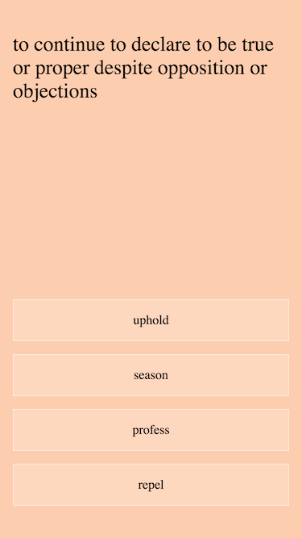
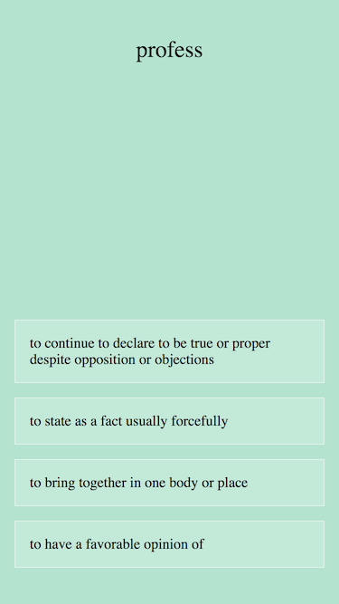

## 영단어 암기장

https://akngs.github.io/flashcards/

## 작동 방식

* 최근에 자주 틀린 단어, 오래 안 봤던 단어가 더 자주 노출되기 때문에 굳이 수준별 단어 목록을 선택할 필요가 없습니다.
* 단어 목록이 지속적으로 갱신됩니다.
* 설명을 보고 단어 맞추기, 단어를 보고 설명 맞추기, 예문을 보고 적절한 단어 고르기 등 다양한 방식으로 단어 암기와 이해를 돕습니다.
* 폰 바탕화면에 저장해 놓고 쓰면 편리합니다.

## 스크린샷

